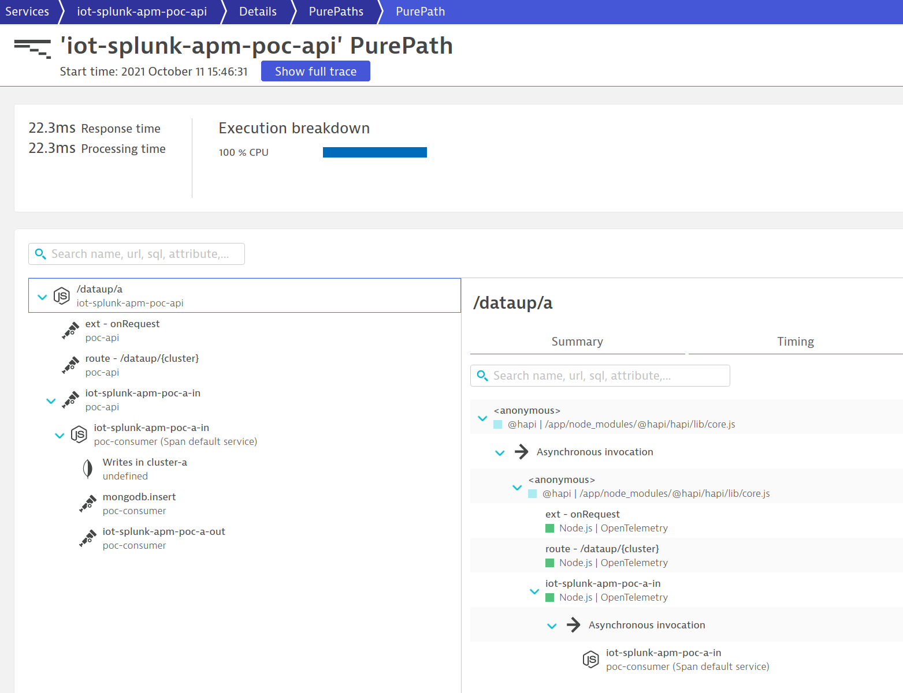
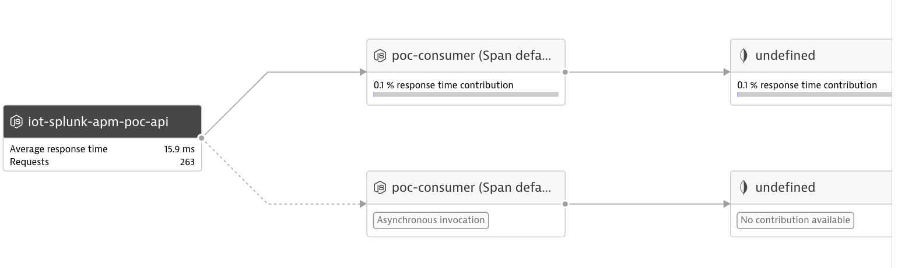
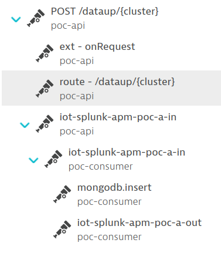
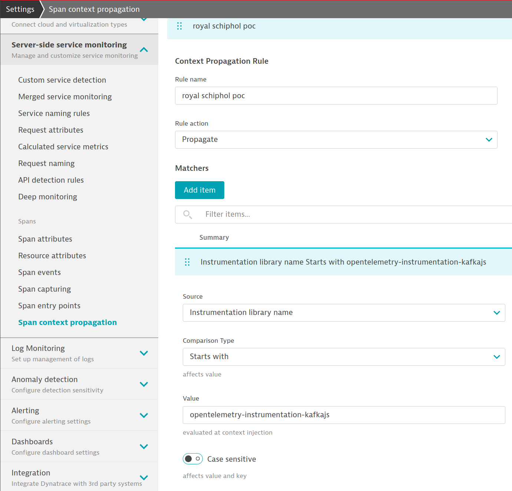

## Description
Sample application showing a NodeJS service that puts an item into a Kafka queue and another NodeJS service that removes the item from the queue and puts it into a MongoDB. This example apparently was used by Royal Schiphol Group to do a PoC of Dynatrace vs. Splunk with regards to OpenTelemetry capabilities (hence the "splunk" names in the services).
Mark Gerards is the original contact who did the Poc with the customer.

### Logical Flow

```
  +------------------+                                           +----------+
  | Client (load gen)| -- HTTP POST on /dataup/{cluster} (1) --> | API:3000 |
  +------------------+                                           +----------+
                                                                   | Produce (2)
                                                                   |
                                                              +-------+
                                                              | Kafka |
                                                              +-------+
                                                   Consume (3) |    |
                                                               |    | Produce (5)
                                                              +----------+                   +-------+
                                                              | Consumer | -- insert (4) --> | Mongo |
                                                              +----------+                   +-------+
```

### Dynatrace service flow (Span Sensor)





### Trace view (Open Ingest)



## Getting started / Running the application
You need `docker` and the `docker-compose` command line utility to run this application.
In the terminal just type `docker-compose up` to build and run the sample with docker compose.

A load generator (client container) is automatically deployed so you don't have to manually create load.

Via the environment variables in `docker-compose.yml` it can be chosen whether the OneAgent should be injected into the process or not. This influences how the spans are reported to Dynatrace (span sensor or open ingest). For the open ingest the OpenTelemetry collector config in `otel-collector/conf.yml` has to be adapted (exporter endpoint and authorization header need to be given).

### Seeing connected PurePaths in Dynatrace
In order to see connected PurePaths in Dynatrace `Span context propagation` for spans created by the instrumentation library `opentelemetry-instrumentation-kafkajs`needs to be enabled:


Also of course the OneAgent span sensor for NodeJS must be activated.

